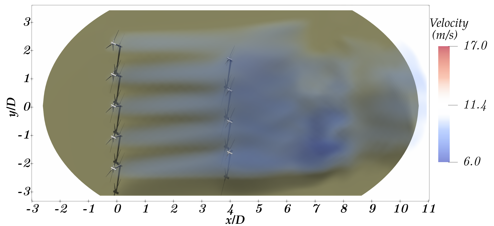
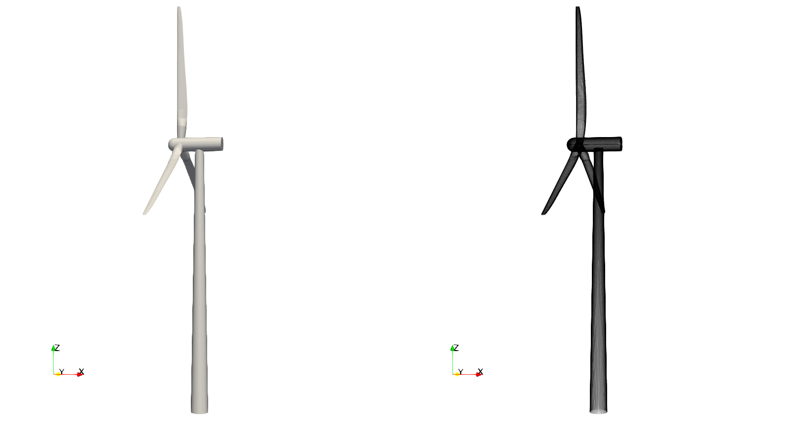
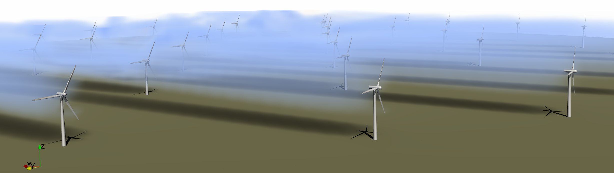
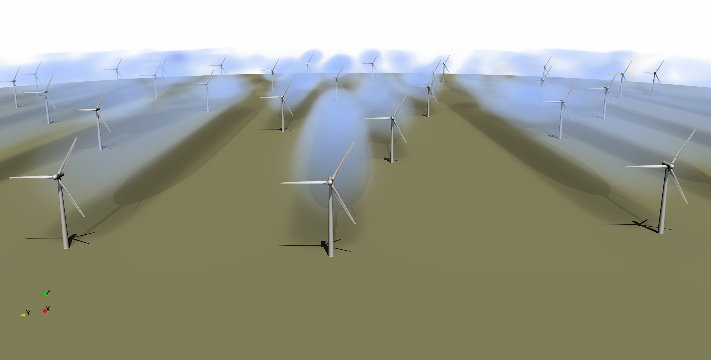
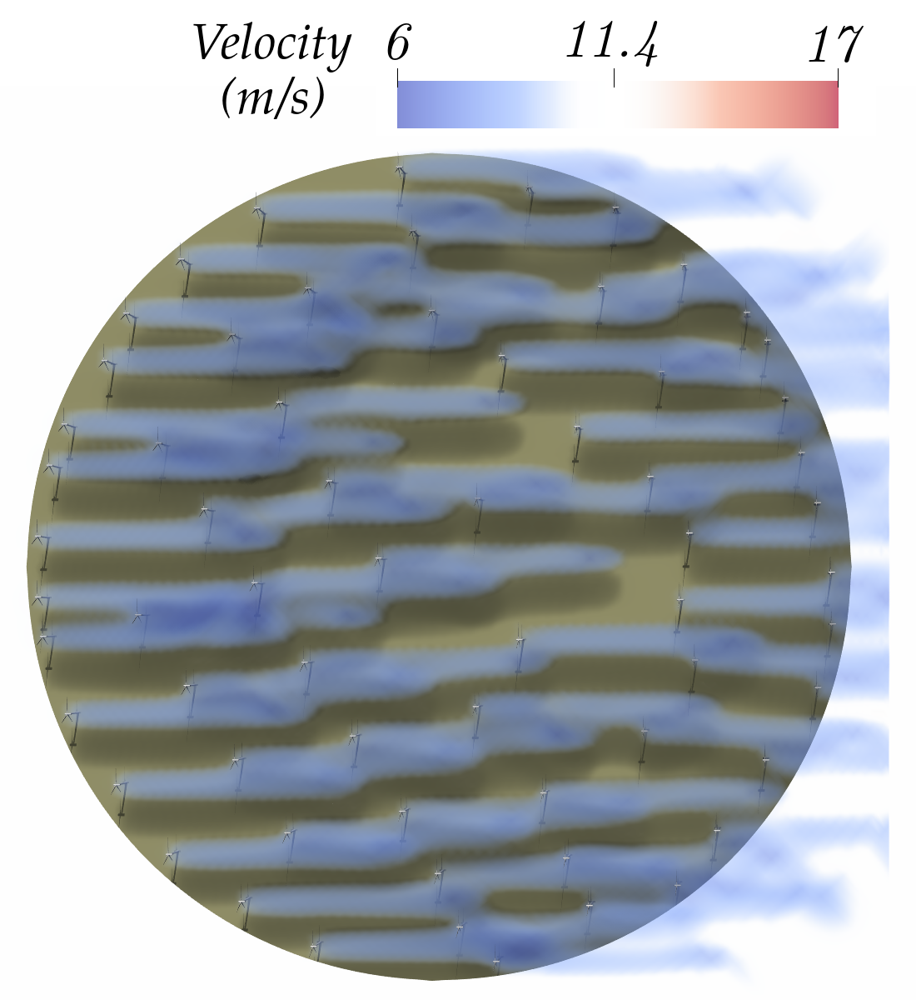

# WFVisual.jl &ndash; Wind Farm Visualizer

Module for the visualization of wind farm layout and wind turbine design optimization.
See [`docs/geometry_processing.ipynb`](https://nbviewer.jupyter.org/github/byuflowlab/wind-farm-utilities/blob/master/docs/geometry_processing.ipynb) and [`examples/simple_windfarm.jl`](https://github.com/byuflowlab/WFVisual.jl/blob/master/examples/simple_windfarm.jl)
for an example on how to use this package.




## Installation
WFVisual was written in Julia v0.6, however, PyJulia (the package that Python
uses to run Julia code) only supports Julia v0.7+. If using WFVisual in
a purely Julia environment, I'd recommend using Julia v0.6 to save the headache
of deprication warnings. Also, for some unkown reason, WFVisual runs incredibly
slow in v0.7+ (for instance, try running the example under
  [`examples/simple_windfarm.jl`](https://github.com/byuflowlab/WFVisual.jl/blob/master/examples/simple_windfarm.jl)).
However, if calling the code through Python, you'll have to set up WFVisual in Julia v0.7.

To get things running, first install the following dependecies (in v0.6 this is
done with the commands `Pkg.add("name_of_package")` and
`Pkg.clone("url_to_geometrictools")`):

* Add the packages PyCall, PyPlot, Dierckx, Roots, QuadGK, JLD, CSV as
```julia
] add name_of_package
```
* Add the `GeometricTools` package as
```julia
] add "https://github.com/byuflowlab/GeometricTools.jl"
```

Then install this package with
```julia
] add "https://github.com/byuflowlab/wind-farm-utilities"
```
or
```julia
Pkg.clone("https://github.com/byuflowlab/wind-farm-utilities")
```
in v0.6.

Then you should be able to run the example [`examples/simple_windfarm.jl`](https://github.com/byuflowlab/WFVisual.jl/blob/master/examples/simple_windfarm.jl) without
any complications changing the variable `save_path` to the path where you want
to save the outputs of this example (make sure the path exists, otherwise it
will throw an error). Notice that this example only takes ~40 seconds to run in
v0.6, meanwhile it takes about 20 minutes in v0.7.

NOTE: This package uses Paraview as its visualizer and it will call it with the
command `run('paraview')` after outputting geometries, so make
sure Paraview is set up in your system and callable through the command line
(see the readme of [GeometricTools](https://github.com/byuflowlab/GeometricTools.jl)
for guidance).

## Calling this package from Python
In order to call this package through Python you will need to install the
Python package PyJulia (I recommend doing it through `pip install pyjulia
--user`). PyJulia by default will call whatever version of Julia it finds
under the terminal command `julia`, and it only works with versions
higher or equal to v0.7. Since WFVisual was written in v0.6, the only
version that will work both with PyJulia and WFVisual is v0.7, so make sure to
have this version as your default system `julia` command (or point PyJulia
manually to it).

The example [`examples/simple_windfarm_python.py`](https://github.com/byuflowlab/WFVisual.jl/blob/master/examples/simple_windfarm_python.py)
shows how this package can be called from Python 2.7.

## Geometry database
Generating blade, hub, and tower geometries is computationally intensive (it
takes about ~20 seconds to generate the grid geometry of a full wind turbine).
In order to avoid this overhead, all blade, hub, and tower geometries are
pre-generated in a normalized scale, and saved as a database of geometries under
the folder `data/` for v0.6 and `datav07` for v0.7. Everytime a windfarm
layout is generated, the normalized pre-generated geometry of every turbine is
read from the database and scaled to its diameter, tower height, and number of
blades indicated to the function `generate_windfarm(...)`, thus avoiding the
overhead of generating the geometry from scratch.

See the notebook [`docs/geometry_processing.ipynb`](https://nbviewer.jupyter.org/github/byuflowlab/wind-farm-utilities/blob/master/docs/geometry_processing.ipynb) for an example on how to add blades, hubs, and
towers to the database.


## Authorship
  * Authors   : Eduardo J Alvarez and PJ Stanley
  * Email     : Edo.AlvarezR@gmail.com
  * Created   : Jul 2018
  * License   : MIT License

## Examples




